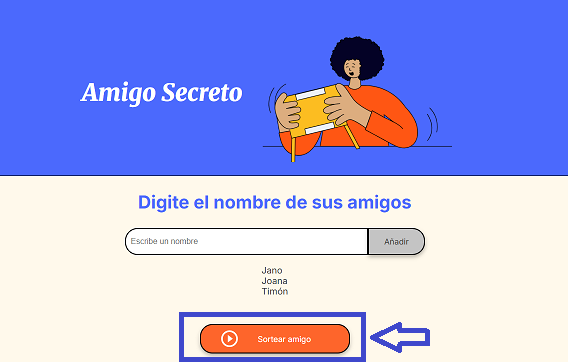
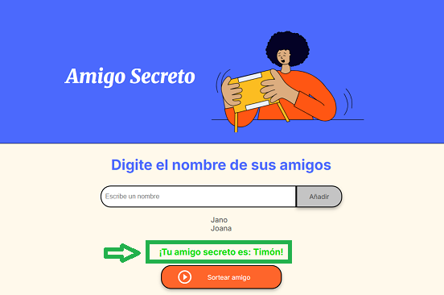

# 🚀 Proyecto: ¡Sorteo de amigo secreto! 
>[!IMPORTANT]
>## Sitio Web funcionando: 
>https://janond2499.github.io/challenge-amigo-secreto/

¡Bienvenido/a a mi proyecto de **Sorteo de amigo secreto**! 🌟 Este proyecto está diseñado como desafio para desarrollar una aplicación que permita a los usuarios ingresar nombres de amigos en una lista para luego realizar un sorteo aleatorio y determinar quién es el "amigo secreto".

## 🚶 Instrucciones: (¡Manos a la Obra!)

* El usuario deberá agregar nombres mediante un campo de texto y un botón "Añadir".

* Los nombres ingresados se mostrarán en una lista visible en la página, y al finalizar, un botón "Sortear Amigo" seleccionará uno de los nombres de forma aleatoria.

* Mostrando los resultados en la pantalla.

---

## 🎯 Objetivos de Aprendizaje

Este proyecto te ayudará a comprender y practicar los siguientes conceptos clave:

* **Manipulación del DOM:** Cómo JavaScript interactúa con tu HTML para añadir y mostrar elementos. 📄
* **Gestión de Arrays:** Uso de `push()` para añadir elementos y `forEach` (o `for`) para recorrerlos. 🧩
* **Lógica Condicional:** Uso de `if` para validaciones (`alert` y `return`). ✅
* **Generación de Aleatoriedad:** Aplicación de `Math.random()` y `Math.floor()` para selecciones al azar. 🎲
* **Navegación entre java y html:** Utilización de elementos como `document.getElementById()` para navegar entre java y html.

---

## 🛠️ Tecnologías Utilizadas

Para este proyecto, he utilizado las siguientes herramientas y lenguajes:

* **HTML5:** Para la estructura de la página web. 🌐
* **CSS3:** Para dar estilos y diseño visual. 🎨
* **JavaScript:** Para la interactividad y lógica del proyecto. 💡
* **Git/GitHub:** para control de versiones. 🐙
* **Visual estudio code:** Edición de codigo. ✔

---

## 💬 Agredecimientos 
Desafío proporcionado por One-Oracle-NextEducation en conjunto con Alura-Latam.

## 💯 Conclusión 
Este proyecto ha sido una excelente oportunidad para integrar HTML, CSS y JavaScript en una aplicación funcional. Logré implementar la manipulación del DOM para agregar y mostrar elementos dinámicamente, gestionar datos con arrays y lógica condicional, e incluso incorporar aleatoriedad para el sorteo. Además, aprendí a mejorar la experiencia de usuario con efectos visuales y a presentar un trabajo de manera profesional con un README.md didáctico.

Este es un paso significativo en mi camino como desarrollador, demostrando mi capacidad para llevar una idea desde el concepto hasta una implementación interactiva y bien documentada.

## 🙋‍♀️ Autor/a:
` Jano Nahuel Duarte ` -  [Mi perfil de GitHub](https://github.com/JanoND2499) 👨‍💻 
